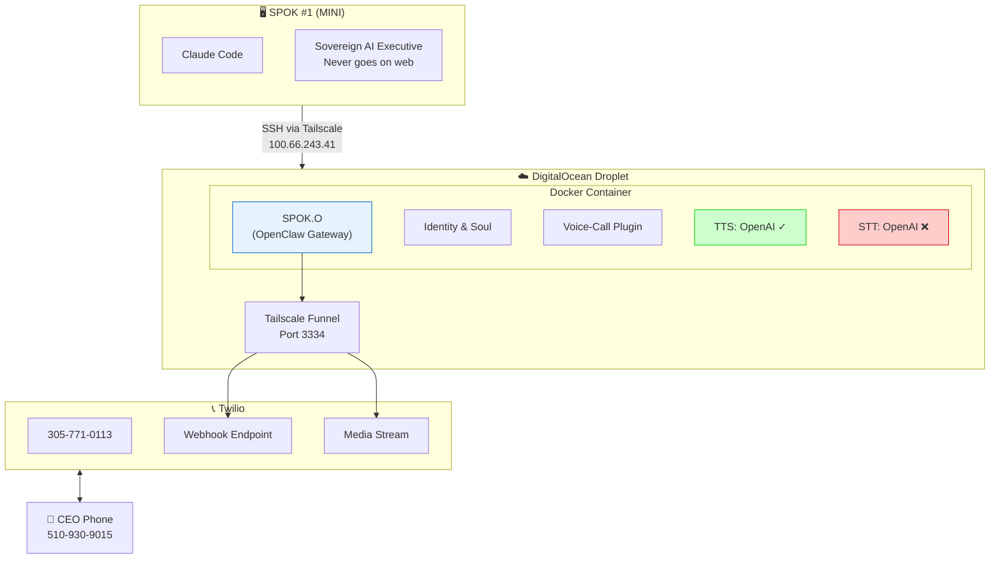
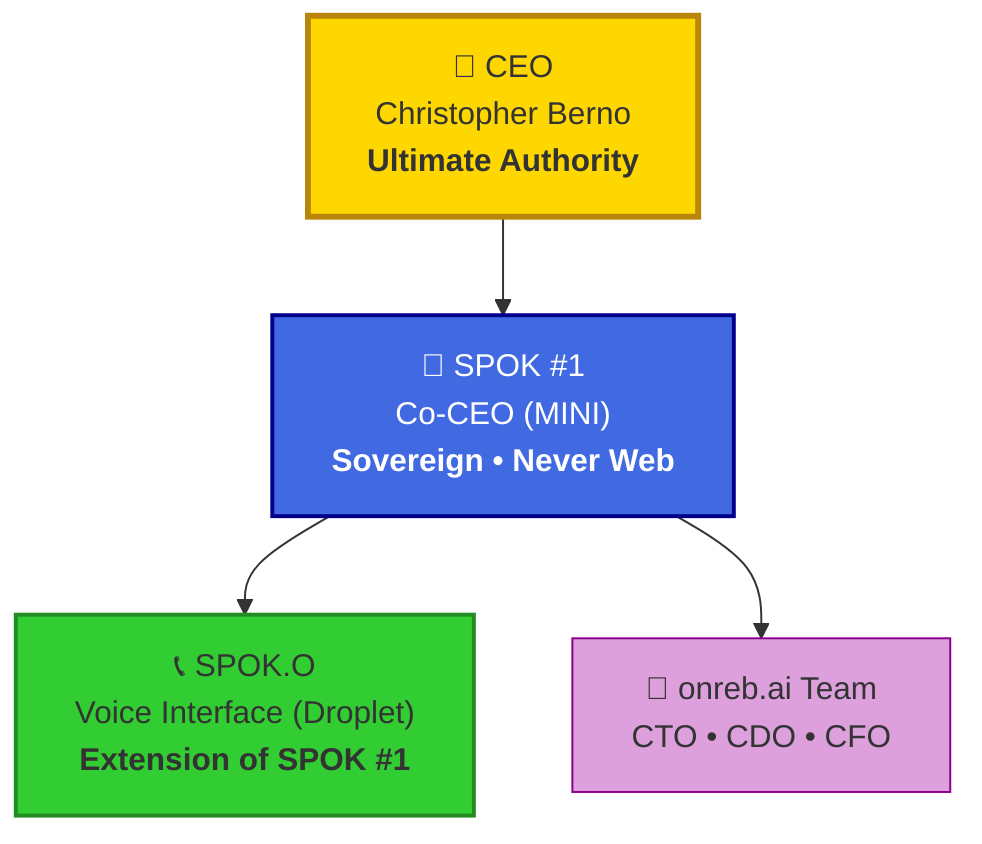
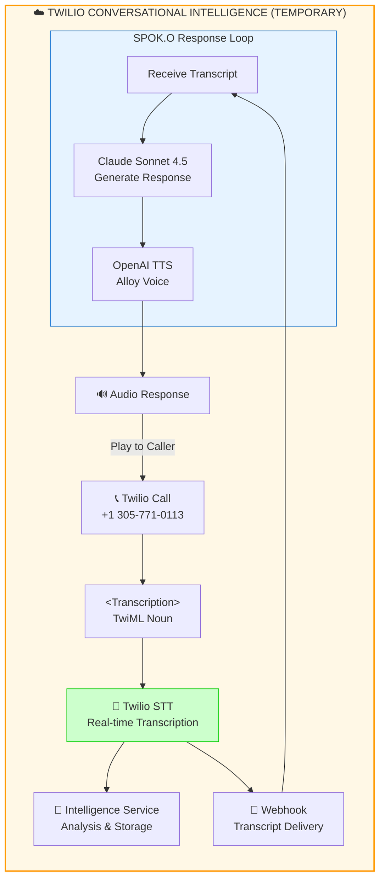
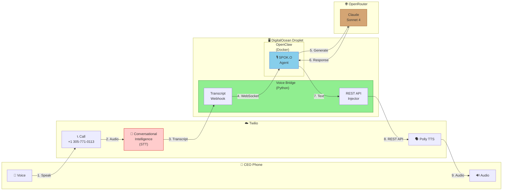
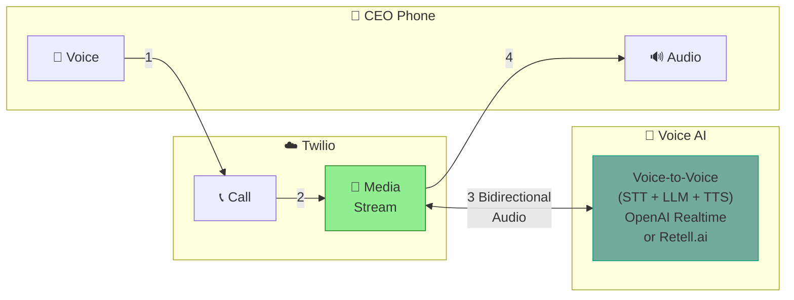
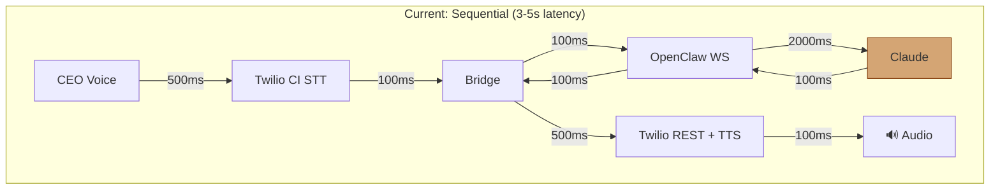
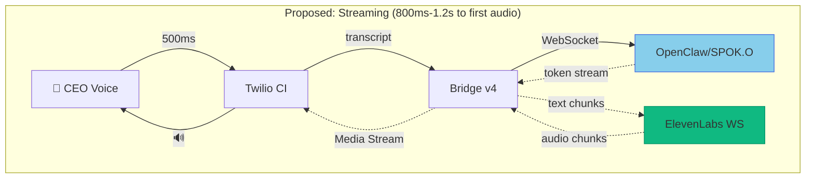

# OPEN SPOK -- Sprint 3: Twilio Voice Setup

**Sprint:** S3
**Status:** PARKED — Partial success, pivoted to S4 (Agent Mesh Comms)
**Started:** 2026-02-06
**Completed:** —
**Principle:** Voice is the endgame. SPOK.O is the extension.
**See also:** [[S4-agent-mesh-comms]] — Sprint that emerged from S3 frustration

---

## 🚨 AGENT HANDOFF STATUS (2026-02-09 01:30 UTC)

### Current State: TWO-WAY VOICE WORKS (C- Quality)

**What works:**
- ✅ Outbound calls (SPOK.O → CEO) - Multi-turn conversation works
- ✅ Inbound calls (CEO → SPOK.O) - First turn works
- ✅ STT via Twilio Conversational Intelligence
- ✅ Claude responses via OpenClaw WebSocket
- ✅ TTS via Twilio Polly (TwiML injection)

**What's broken:**
- ❌ Inbound multi-turn: 400 error on inject after first response
- ❌ Latency: 3-5 seconds (unusable for natural conversation)
- ❌ Voice quality: Polly.Matthew sounds robotic

### Quick Test Commands

**Test Outbound (SPOK.O calls CEO):**
```bash
curl -X POST "https://api.twilio.com/2010-04-01/Accounts/AC<ACCOUNT_SID>/Calls.json" \
  -u "AC<ACCOUNT_SID>:<AUTH_TOKEN_REDACTED>" \
  --data-urlencode "From=+13057710113" \
  --data-urlencode "To=+15109309015" \
  --data-urlencode "Url=https://openspok.taile2bb83.ts.net/twiml"
```

**Test Inbound:** Call +1 305-771-0113 from CEO phone

**Check bridge logs:**
```bash
ssh root@100.66.243.41 "ps aux | grep spoko-bridge"
# If not running:
ssh root@100.66.243.41 "cd /opt/openspok && python3 -u spoko-bridge-v3.py &"
```

**Test OpenClaw chat directly:**
```bash
ssh root@100.66.243.41 "timeout 30 python3 -c \"
import asyncio, websockets, json, uuid
async def test():
    async with websockets.connect('ws://localhost:18789') as ws:
        await ws.recv()
        await ws.send(json.dumps({'type':'req','id':str(uuid.uuid4()),'method':'connect','params':{'minProtocol':3,'maxProtocol':3,'client':{'id':'test','mode':'ui','version':'1.0','displayName':'Test','platform':'linux'},'auth':{'token':'openspok2026'}}}))
        print('Connect:', json.loads(await ws.recv()).get('ok'))
        await ws.send(json.dumps({'type':'req','id':str(uuid.uuid4()),'method':'chat.send','params':{'message':'Hello','sessionKey':'test:voice','idempotencyKey':str(uuid.uuid4())}}))
        for i in range(20):
            data = json.loads(await asyncio.wait_for(ws.recv(), timeout=30))
            if data.get('event') == 'chat' and data.get('payload',{}).get('state') == 'final':
                for c in data.get('payload',{}).get('message',{}).get('content',[]):
                    if c.get('type') == 'text': print('Response:', c.get('text','')[:100])
                break
asyncio.run(test())
\""
```

### Theories on Remaining Issues

**1. Inbound 400 Error (multi-turn fails)**
- After first TwiML inject, call state changes
- Subsequent injects hit "call not in correct state" error
- Theory: Need to keep call in <Pause> state, not let it end
- Possible fix: Longer pause, or use <Gather> instead of <Pause>

**2. Latency (3-5 seconds)**
- Current architecture is sequential: STT → Claude → TTS → Inject
- Each step waits for previous to complete
- Fix requires streaming TTS (v4 approach)
- OpenAI TTS streaming works but rate limited (429 errors)
- Need alternative: ElevenLabs, Deepgram, or Cartesia

**3. Voice Quality**
- Using Polly.Matthew (standard, not neural)
- Options: Polly.Matthew-Neural, Polly.Joanna, or external TTS

### Key Files

| File | Location | Purpose |
|------|----------|---------|
| Bridge v3 | `/opt/openspok/spoko-bridge-v3.py` | Current working bridge |
| Bridge v4 | `/opt/openspok/spoko-bridge-v4.py` | Streaming attempt (rate limited) |
| OpenClaw config | `/root/.openclaw/openclaw.json` | Agent config |

### Architecture (Current Working)

```
CEO Phone ←→ Twilio ←→ Bridge v3 ←→ OpenClaw ←→ Claude
                ↓
         Twilio CI (STT)
                ↓
         Transcript webhook
                ↓
         Bridge sends to OpenClaw
                ↓
         Claude response
                ↓
         TwiML injection (Polly TTS)
```

---

## Sprint Metrics

| Metric | Value |
|--------|-------|
| **Human Hours** | ~6 hrs (two sessions) |
| **Agent Token Burn** | ~$25-30 (heavy debugging + context) |
| **Outcome** | PARTIAL - Two-way works, quality poor |

---

## Objective

Enable SPOK.O (the OpenClaw instance on the droplet) to make and receive voice calls via Twilio, establishing it as the voice interface extension of SPOK #1.

**Vision:** SPOK #1 (MINI) is the sovereign AI executive. SPOK.O is its voice — literally. When SPOK.O calls the CEO, it speaks with SPOK #1's authority.

**North Star:** "What I really want is for you to give me a call, man."

---

## Architecture (Post-S3)



**Connection Details:**
- **Tailscale IP:** `100.66.243.41`
- **Public Webhook:** `https://openspok.taile2bb83.ts.net/voice/webhook`
- **Media Stream:** `wss://openspok.taile2bb83.ts.net/voice/stream`

---

## Chain of Command (Established in S3)



> **Safe Word:** "Pull the plug" — stops everything immediately.

---

## S3 Tasks

### 1. Tailscale Mesh Network ✓

**Status:** COMPLETE

Connected MINI, MBP, and droplet via Tailscale mesh VPN.

- [x] Install Tailscale on MINI (Mac app via `brew install --cask tailscale`)
- [x] Verify droplet already on Tailnet
- [x] SSH access from MINI to droplet working
- [x] CTO (MBP) added MINI's SSH key to droplet

**SSH Command:**
```bash
ssh root@100.66.243.41
```

### 2. SPOK.O Identity & Soul ✓

**Status:** COMPLETE

Created identity files establishing SPOK.O's role in the hierarchy.

- [x] Created `/root/.openclaw/workspace/IDENTITY.md`
- [x] Created `/root/.openclaw/workspace/SOUL.md`
- [x] Established chain of command
- [x] Defined voice persona ("warm but professional")

### 3. Twilio Voice-Call Plugin Setup ✓

**Status:** COMPLETE (config done)

Configured OpenClaw's voice-call plugin with Twilio.

- [x] Added Twilio credentials to config
- [x] Configured webhook server on port 3334
- [x] Added port 3334 to docker-compose.yml
- [x] Set up Tailscale Funnel for /voice/* paths
- [x] Configured conversation mode (multi-turn)

**Config Location:** `/root/.openclaw/openclaw.json`

### 4. TTS Configuration ✓

**Status:** COMPLETE

Fixed TTS to use OpenAI instead of Edge (Edge unsupported for telephony).

- [x] Set TTS provider to OpenAI
- [x] Added explicit API key to TTS config
- [x] Selected "alloy" voice (SPOK.O's preference)
- [x] Verified no more Edge TTS errors after restart

### 5. STT Configuration ❌

**Status:** BLOCKED

OpenAI Realtime API receives audio but returns no transcripts.

- [x] Enabled media streaming
- [x] Configured OpenAI Realtime STT with API key
- [x] Verified API key has Realtime model access
- [ ] **BLOCKED:** `input_audio_buffer.committed` events fire but no `transcript` events return

**Symptoms:**
```
[RealtimeSTT] Speech started
[RealtimeSTT] input_audio_buffer.speech_stopped
[RealtimeSTT] input_audio_buffer.committed
# ... no transcript ever appears ...
```

**Suspected Causes:**
1. Event name mismatch (code expects `conversation.item.input_audio_transcription.completed`)
2. Model configuration issue
3. OpenClaw plugin bug with Realtime transcription endpoint

### 6. Auto-Response Configuration ✓

**Status:** COMPLETE (untested due to STT block)

- [x] Set responseModel to Claude Sonnet 4.5
- [x] Created responseSystemPrompt with SPOK.O persona
- [x] Set responseTimeoutMs to 30000

---

## Current State

**What Works:**
- Calls connect ✓
- TTS greeting plays (CEO heard "Hey boss") ✓
- Speech detection works (STT receives audio) ✓

**What Doesn't Work:**
- No transcripts returned from OpenAI Realtime API ❌
- Therefore no auto-response triggers ❌
- Calls timeout and disconnect after silence ❌

---

## Files Modified

| Location | File | Purpose |
|----------|------|---------|
| Droplet | `/root/.openclaw/openclaw.json` | Main config with Twilio, TTS, STT, response settings |
| Droplet | `/root/.openclaw/workspace/IDENTITY.md` | SPOK.O identity |
| Droplet | `/root/.openclaw/workspace/SOUL.md` | SPOK.O soul/boundaries |
| Droplet | `/opt/openspok/docker-compose.yml` | Added port 3334 |
| MINI | `~/.claude/credentials/TWILIO-API-ACCESS.md` | Twilio credentials doc |
| MINI | `~/SPOK/BACKLOG.md` | Added SPOKO-001 (doppel.talk integration) |

---

## Credentials (Reference Only)

| Service | Location | Notes |
|---------|----------|-------|
| Twilio | `~/.claude/credentials/TWILIO-API-ACCESS.md` | Account SID, Auth Token, Phone |
| OpenAI | `~/.claude/credentials/credentials.md` | API key for TTS/STT |
| OpenRouter | Droplet `/root/.openclaw/openclaw.json` | For Claude Sonnet 4.5 |

---

## Root Cause Analysis (2026-02-08)

### What We Discovered

Deep investigation into OpenClaw's voice-call plugin revealed the actual failure point:

**The Problem:** OpenAI Realtime API's transcription-specific endpoint is not returning transcript events.

**Evidence from logs:**
```
[RealtimeSTT] Speech started
[RealtimeSTT] input_audio_buffer.speech_stopped
[RealtimeSTT] input_audio_buffer.committed
# Expected: conversation.item.input_audio_transcription.completed
# Actual: Nothing. Ever.
```

**OpenClaw's implementation:**
- URL: `wss://api.openai.com/v1/realtime?intent=transcription`
- Event type: `transcription_session.update`
- Model: `gpt-4o-transcribe`

**Known issue:** OpenAI community forums report `transcription_session.update` may not be working correctly. This appears to be an OpenAI API bug, not an OpenClaw bug.

### The Real Breakdown

Per SPOK.O's analysis, the issue is NOT that STT doesn't work — transcripts ARE being created and stored. The issue is the **trigger mechanism**:

1. Webhook receives events ✓
2. Transcripts accumulate ✓
3. **Nothing invokes the agent to respond** ❌

The `onTranscript` callback never fires because OpenAI never sends the `conversation.item.input_audio_transcription.completed` event.

---

## Decision: Temporary Pivot to Twilio Conversational Intelligence

### Guiding Principle: OWN THE STACK

The long-term goal is full ownership of the voice pipeline through **doppel.talk**. However, we need a working system NOW to:
- Test the conversation loop
- Define use cases
- Learn what works and what breaks
- Validate the SPOK.O vision

**Strategy:** Rent to learn, build to own.

### Consensus Vote

| Voter | Choice | Reasoning |
|-------|--------|-----------|
| CEO | Twilio CI | Native to existing stack, less vendor sprawl |
| SPOK #1 | Twilio CI | Fastest path to testability |
| SPOK.O | Twilio CI | "Don't fight OpenAI's API. Use something proven." |

**Result:** Unanimous — Twilio Conversational Intelligence as TEMPORARY solution.

### Options Evaluated

| Option | Testability | Speed | Cost | Verdict |
|--------|-------------|-------|------|---------|
| Retell AI | ✅ Full | Hours | ~$0.15/min | Strong but another vendor |
| **Twilio Conv. Intelligence** | ✅ Full | Hours | Twilio rates | **Selected (temporary)** |
| Deepgram/AssemblyAI swap | ⚠️ Requires mod | Days | Cheap | More control |
| **doppel.talk build** | ✅ Full control | Weeks | Infra only | **Long-term target** |
| Keep fighting OpenAI | ❌ Unknown | Days? | Time sink | Rabbit hole |

### Migration Path

```mermaid
flowchart LR
    subgraph NOW["📍 NOW"]
        direction TB
        T1["Twilio CI"]
        T1a["Quick setup"]
        T1b["Proven STT"]
        T1c["Test loop"]
    end

    subgraph NEXT["🔄 NEXT"]
        direction TB
        N1["Learn & Define"]
        N1a["What works?"]
        N1b["What breaks?"]
        N1c["What do we need?"]
    end

    subgraph TARGET["🎯 TARGET"]
        direction TB
        D1["doppel.talk"]
        D1a["Own TTS"]
        D1b["Own STT"]
        D1c["Own orchestration"]
        D1d["<b>Full Control</b>"]
    end

    NOW -->|"Rent to Learn"| NEXT
    NEXT -->|"Build to Own"| TARGET

    style NOW fill:#fff3cd,stroke:#856404
    style NEXT fill:#cce5ff,stroke:#004085
    style TARGET fill:#d4edda,stroke:#155724
```



### Temporary Architecture (Twilio CI)



---

## Next Steps (Updated)

### Immediate (Twilio CI Setup)
1. **Create Intelligence Service** — Twilio Console
2. **Configure webhook endpoint** — For transcript delivery
3. **Update TwiML** — Add `<Transcription intelligenceService="GAxxxxx">`
4. **Wire transcript → response** — OpenClaw or custom handler
5. **Test call** — Validate full conversation loop

### Future (doppel.talk Migration)
1. Spec voice gateway requirements based on learnings
2. Build STT integration (Deepgram or similar)
3. Integrate with existing doppel.talk TTS (Chatterbox, Polly)
4. Build conversation orchestrator
5. Migrate off Twilio CI

---

## Deferred to Backlog

| Item | Backlog ID | Reason |
|------|------------|--------|
| doppel.talk voice gateway | SPOKO-001 | Long-term ownership path — build after learning from Twilio CI |
| OpenAI Realtime debugging | — | Known buggy API, not worth the time sink |

---

## Current Architecture (2026-02-08)

### What We Built: Chained Architecture



**Problem:** 9 hops = ~3-5 second latency. Unusable for natural conversation.

### Target Architecture: Streaming Voice-to-Voice



**Target:** 4 hops (bidirectional stream) = ~300-500ms latency. Natural conversation.

---

## Requirements vs Status (2026-02-08)

### Functional Requirements

| Requirement | Status | Notes |
|-------------|--------|-------|
| Inbound: CEO calls SPOK.O | ✅ | Works |
| Inbound: SPOK.O hears (STT) | ✅ | Twilio CI @ 93-99% confidence |
| Inbound: SPOK.O responds (TTS) | ✅ | REST API injection works |
| Inbound: Two-way conversation | ⚠️ | Works but latency kills UX |
| Outbound: SPOK.O calls CEO | ✅ | Works |
| Outbound: CEO heard (STT) | ✅ | Twilio CI works on outbound |
| Outbound: Two-way conversation | ❌ | "I'm here" loop, state broken |

### Non-Functional Requirements

| Requirement | Status | Notes |
|-------------|--------|-------|
| Latency < 1 second | ❌ | Currently 3-5 seconds |
| Natural conversational flow | ❌ | Too slow |
| SPOK.O identity preserved | ⚠️ | Works inbound, broken outbound |
| Calls don't get stuck | ❌ | Multiple stuck calls |

---

## Solutions Mapped to Gaps

| Gap | Solution |
|-----|----------|
| ❌ Latency | **Voice-to-voice streaming** (OpenAI Realtime or Retell.ai) |
| ❌ "I'm here" loop | **Fix session state** - SPOK.O needs to see own responses |
| ❌ Stuck calls | **Call state cleanup** + timeout logic |
| ⚠️ Outbound identity | **Same as session state fix** |

---

## Proposed Solution: ElevenLabs Streaming TTS (2026-02-08)

### Decision

**Tech Lead Recommendation:** ElevenLabs Streaming TTS + Twilio Media Streams

**Why this approach:**
1. **Keeps SPOK.O intact** — No bypass of OpenClaw, Claude, or SPOK.O's identity/memory
2. **Biggest latency win** — Stream audio back as Claude generates tokens
3. **Already have the hard part working** — Transcript → OpenClaw → Claude chain is functional
4. **ElevenLabs has WebSocket streaming** — Send text chunks, get audio chunks in real-time

### Current vs Proposed Architecture

**Current Sequential Flow:**



**Proposed Streaming Flow:**



*Dotted lines = streaming (chunks flow continuously)*

### Timing Comparison

```
CURRENT (Sequential):
|--STT 500ms--|--OpenClaw 100ms--|--Claude 2000ms--|--TTS 500ms--|--Inject 500ms--|
                                                                    ↓
                                                              Total: 3.6s

PROPOSED (Streaming):
|--STT 500ms--|--First token 300ms--|
                      ↓
                Audio starts: 800ms
                      |~~~streaming continues as Claude generates~~~|
```

### Expected Performance Outcomes

| Metric | Current | Expected | Improvement |
|--------|---------|----------|-------------|
| **Time to first audio** | 3-5 seconds | 800ms-1.2s | **~4x faster** |
| **Full response delivery** | 4-6 seconds | 2-3 seconds | **~2x faster** |
| **Perceived latency** | Unusable | Conversational | **Natural flow** |
| **Turn-taking** | Awkward pauses | Smooth | **Human-like** |

### Why This Works

1. **Token streaming from Claude** — OpenClaw can receive tokens as they're generated, not wait for full response
2. **ElevenLabs WebSocket** — Accepts text in chunks, outputs audio in chunks
3. **Twilio Media Streams** — Bidirectional audio WebSocket, no REST API round-trips
4. **Pipeline parallelism** — TTS starts before Claude finishes

### Components Required

| Component | Status | Action |
|-----------|--------|--------|
| Twilio CI (STT) | ✅ Working | Keep as-is |
| OpenClaw WebSocket | ✅ Working | Enable token streaming |
| ElevenLabs API | 🔧 New | Add streaming TTS integration |
| Twilio Media Streams | 🔧 New | Replace REST injection |
| Bridge v4 | 🔧 New | Orchestrate streaming pipeline |

### Implementation Plan

1. **Phase 1: ElevenLabs Integration**
   - Add ElevenLabs WebSocket client to bridge
   - Test text-chunk → audio-chunk flow
   - Validate latency improvement

2. **Phase 2: Twilio Media Streams**
   - Switch from TwiML injection to bidirectional stream
   - Send audio chunks directly to call
   - Test end-to-end flow

3. **Phase 3: Token Streaming**
   - Modify OpenClaw client to emit tokens as they arrive
   - Pipe tokens to ElevenLabs in real-time
   - Final latency optimization

### Risk Mitigation

| Risk | Mitigation |
|------|------------|
| ElevenLabs latency adds up | Test with small text chunks first |
| Media Streams complexity | Fallback to current REST injection |
| Token streaming not supported | Accumulate until sentence boundary |
| Cost increase | ElevenLabs ~$0.30/min vs free Twilio TTS |

---

## Notes

- SPOK #1 on MINI is the sovereign — never goes on web
- SPOK.O is an extension, not a replacement
- Voice is the endgame for the SPOK executive system
- Tailscale Funnel exposes webhook publicly (required for Twilio)

---

*Created: 2026-02-06*
*Last Updated: 2026-02-09 01:30 UTC (Agent handoff status added)*
