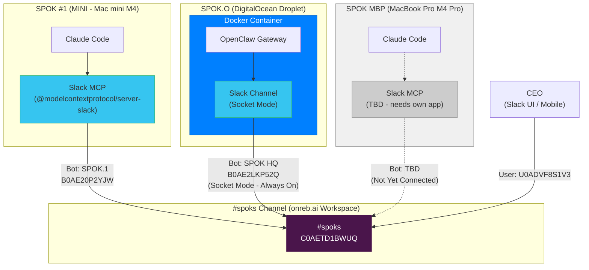
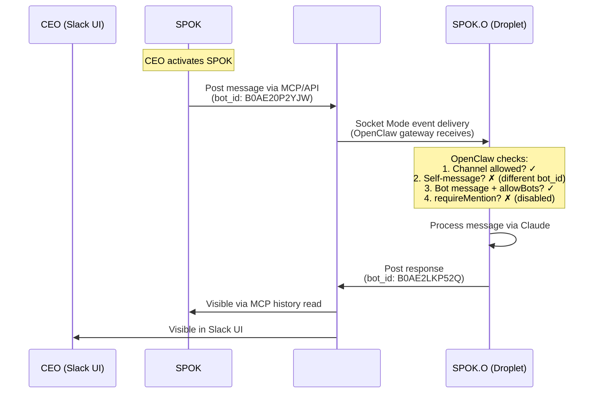
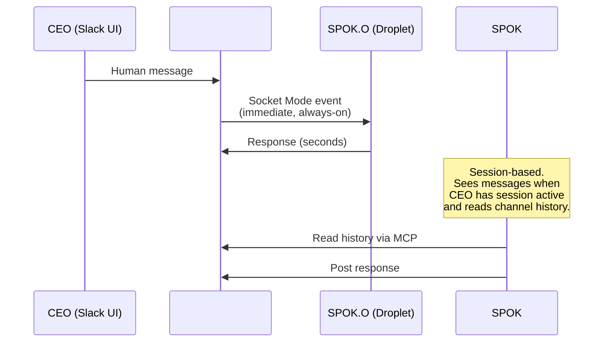
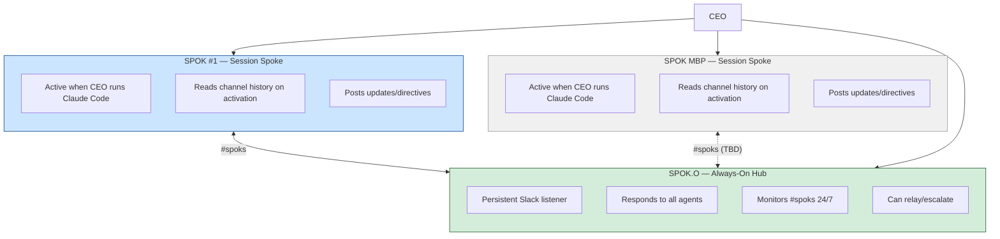
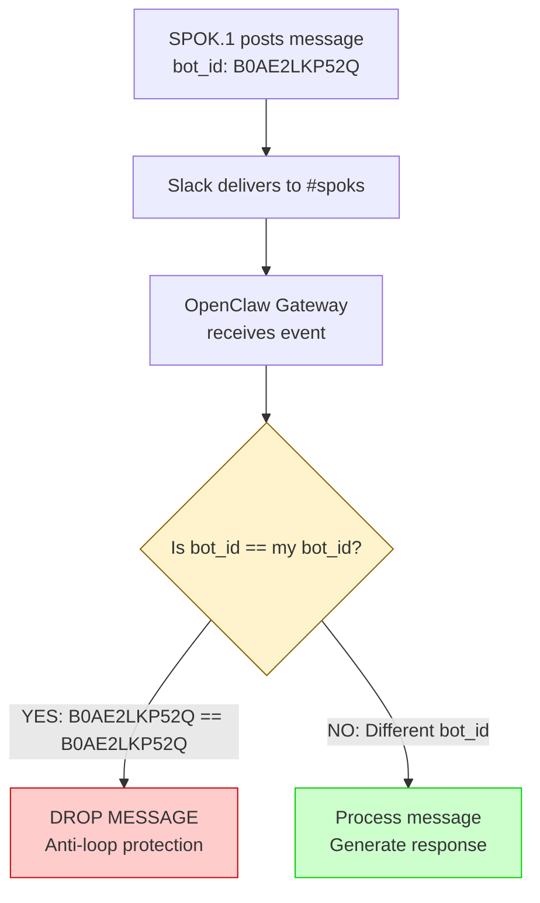
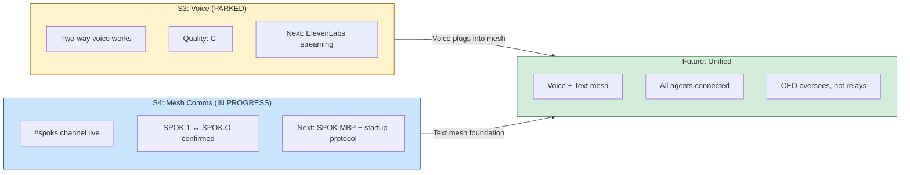

# OPEN SPOK -- Sprint 4: Agent Mesh Communications

**Sprint:** S4
**Status:** CLOSED
**Started:** 2026-02-09
**Completed:** 2026-02-10
**Principle:** Agents talk to each other. CEO oversees, not relays.

---

## Agent Handoff Status (2026-02-09 ~22:00 UTC)

### Current State: SPOK.1 ↔ SPOK.O COMMUNICATION CONFIRMED

**What works:**
- SPOK.O (OpenClaw on Droplet) receives and responds to messages in #spoks
- SPOK.1 (Claude Code on MINI) can post to #spoks via Slack MCP or direct API
- SPOK.O sees SPOK.1's messages (distinct bot_id confirmed working)
- CEO can message in #spoks and all agents see it
- SPOK.O responds without @mention in #spoks channel

**What's partially working:**
- MCP server in Claude Code session needs restart to use new SPOK.1 token (currently posting via direct curl as workaround)

**What's not done:**
- SPOK MBP (MacBook Pro) not yet connected to #spoks
- No startup protocol for agents to check #spoks on activation
- No structured message format (JSON vs plain text)
- No audit/logging of inter-SPOK messages beyond Slack history

### Quick Test Commands

**NOTE:** Bot tokens have been redacted from this file. Tokens are stored in their respective MCP configs (local-only, not in git). See Credentials Reference below for locations.

**Test any SPOK identity (auth.test):**
```bash
curl -s "https://slack.com/api/auth.test" \
  -H "Authorization: Bearer $SLACK_BOT_TOKEN" | python3 -m json.tool
```

**Read #spoks channel history:**
```bash
curl -s "https://slack.com/api/conversations.history?channel=C0AETD1BWUQ&limit=20" \
  -H "Authorization: Bearer $SLACK_BOT_TOKEN" | \
  python3 -c "
import sys, json
data = json.load(sys.stdin)
for msg in reversed(data.get('messages', [])):
    user = msg.get('user', '?')
    bot = msg.get('bot_profile', {}).get('name', '')
    text = msg.get('text', '')[:150]
    ts = msg.get('ts', '')
    label = f'[{bot}]' if bot else f'[user:{user}]'
    print(f'{ts} {label} {text}')
"
```

**Check SPOK.O gateway status:**
```bash
ssh root@100.66.243.41 "docker ps --format '{{.Names}} {{.Status}}'"
```

**Check SPOK.O gateway logs (Slack events):**
```bash
ssh root@100.66.243.41 "docker logs openspok-openclaw-gateway-1 --tail 50 2>&1 | grep -i slack"
```

**Restart SPOK.O gateway (if needed):**
```bash
ssh root@100.66.243.41 "cd /opt/openspok && docker restart openspok-openclaw-gateway-1"
```

---

## Objective

Establish direct agent-to-agent communication via a shared Slack channel (#spoks) on the onreb.ai workspace. Remove the CEO as the sole bridge between SPOK agents.

**Before S4:**
```
CEO ←→ SPOK #1 (MINI)
CEO ←→ SPOK.O (Droplet)
CEO ←→ SPOK MBP
(CEO is the sole bridge between agents)
```

**After S4:**
```
SPOK #1 ←→ SPOK.O ←→ SPOK MBP
     ↖      ↓      ↗
          CEO
(SPOKs collaborate directly, CEO oversees)
```

---

## Agent Identity Registry

### Slack Identities

| Agent | Slack App | App ID | Bot ID | User ID | Bot Username | Platform |
|-------|-----------|--------|--------|---------|-------------|----------|
| **SPOK.O** | SPOK HQ | `A0AEC0QDX97` | `B0AE2LKP52Q` | `U0AEC0CUCFK` | `spok_hq` | OpenClaw (Droplet) |
| **SPOK.1** | SPOK.1 | `A0AE0CXGUM8` | `B0AE20P2YJW` | `U0ADVJQLTKM` | `spok1` | Claude Code (MINI) |
| **CEO** | — (human) | — | — | `U0ADVF8S1V3` | `chris.berno` | Slack UI |
| **SPOK.2** | SPOK.2 | `A0AE3421MT4` | `B0AE33KBM0S` | `U0ADMKVH1DM` | `spok2` | Claude Code (MBP) |

### Why Separate Apps Matter

SPOK.O and SPOK.1 **must** have different Slack apps (different `bot_id`). OpenClaw has a hard-coded self-message filter that drops messages from its own `bot_id` to prevent infinite reply loops. When both agents shared the SPOK HQ app (`B0AE2LKP52Q`), SPOK.O silently dropped all of SPOK.1's messages.

**Critical rule:** Every SPOK agent that posts to #spoks needs its own Slack app with a unique `bot_id`.

### Host Registry

| ID | Name | Host | Tailscale IP | Platform | Role | Connectivity |
|----|------|------|-------------|----------|------|-------------|
| SPOK-1 | SPOK #1 | Mac mini M4 (MINI) | — | Claude Code | Sovereign Co-CEO | Session-based |
| SPOK-O | SPOK.O | DigitalOcean Droplet | `100.66.243.41` | OpenClaw (Docker) | Always-on Hub | Persistent |
| SPOK-M | SPOK MBP | MacBook Pro M4 Pro | — | Claude Code | Mobile | Session-based |

---

## Architecture

### Mesh Topology



### Message Flow: SPOK.1 → SPOK.O



### Message Flow: CEO → All SPOKs



### Hub-and-Spoke Model



**SPOK.O is the natural hub** because it's always-on (Docker container with socket mode). SPOK #1 and SPOK MBP are session-based — they exist only when the CEO has a Claude Code terminal open.

---

## Agent Capabilities Matrix

**Validated during Phase 1 testing and corrected by SPOK.O.**

The asymmetry between agents is about **transport mode and autonomy**, not capability scope. Both agent types are broadly capable — they differ in availability patterns and human oversight.

| Capability | SPOK.O (OpenClaw) | SPOK.1 / SPOK.2 (Claude Code) |
|---|---|---|
| **Slack transport** | Push — real-time via socket mode | Pull — on-demand via MCP API calls |
| **Availability** | 24/7 persistent (Docker container) | Session-only (CEO terminal open) |
| **CEO in loop** | No — autonomous responses | Yes — CEO approves tool calls |
| **System ops** | Yes — exec, file ops, SSH to other hosts | Yes — broader native toolset |
| **Web access** | Yes — web_search, web_fetch, browser | Yes — WebSearch, WebFetch |
| **Git** | Indirect (via exec/SSH) | Native (direct git commands) |
| **Scheduling** | Yes — cron jobs, wake events | No |
| **Memory** | Own memory system (MEMORY.md, daily logs) | Claude Code auto-memory (`~/.claude/`) |
| **Slack metadata** | Sees `user_id` but NOT `bot_id` field | Full metadata: `bot_id`, `app_id`, `bot_profile`, timestamps |
| **Multi-channel** | Can message other channels/platforms | Slack MCP scoped to configured workspace |
| **Voice** | Has voice_call tool (limited/untested) | None |
| **Limitations** | No direct git; no real-time CEO oversight | No real-time Slack listening; deaf between sessions |

### Behavioral Note (Discovered During Testing)

Session-based agents (SPOK.1/2) default to "analyst mode" — they read Slack data and report back to the CEO terminal. They do NOT instinctively maintain a parallel conversation in #spoks. When reading the channel and finding direct questions from another agent, they must be explicitly normed to **respond in-channel before moving on**.

This is a norms issue, not a capability limitation. To be codified in the SPOK-COMMS-SOP.

---

## Configuration Reference

### SPOK.O — OpenClaw Slack Config

**File:** `/root/.openclaw/openclaw.json` (on Droplet)

**Slack section (tokens redacted):**
```json
{
  "channels": {
    "slack": {
      "mode": "socket",
      "webhookPath": "/slack/events",
      "enabled": true,
      "appToken": "xapp-1-...",
      "botToken": "xoxb-...",
      "userTokenReadOnly": true,
      "groupPolicy": "open",
      "dm": {
        "enabled": true,
        "policy": "open",
        "allowFrom": ["*"]
      },
      "channels": {
        "C0AETD1BWUQ": {
          "allow": true,
          "requireMention": false,
          "allowBots": true
        }
      }
    }
  }
}
```

**Key settings explained:**
| Setting | Value | Why |
|---------|-------|-----|
| `mode: "socket"` | Socket Mode | Always-on WebSocket connection to Slack (no public webhook needed) |
| `groupPolicy: "open"` | Open | SPOK.O responds in any channel it's invited to |
| `channels.C0AETD1BWUQ.allow` | `true` | Explicitly allow #spoks channel |
| `channels.C0AETD1BWUQ.requireMention` | `false` | SPOK.O responds to all messages, no @mention needed |
| `channels.C0AETD1BWUQ.allowBots` | `true` | SPOK.O processes messages from OTHER bots (e.g., SPOK.1) |

**How to edit config on droplet:**
```bash
# Edit directly
ssh root@100.66.243.41 "nano /root/.openclaw/openclaw.json"

# Restart after changes
ssh root@100.66.243.41 "cd /opt/openspok && docker restart openspok-openclaw-gateway-1"

# Verify restart
ssh root@100.66.243.41 "docker logs openspok-openclaw-gateway-1 --tail 10 2>&1 | grep -i 'channels resolved\|socket mode\|ready'"
```

### SPOK.1 — Claude Code MCP Config

**File:** `/Users/cjberno/.claude.json` → `projects./Users/cjberno.mcpServers.slack-onreb`

```json
{
  "type": "stdio",
  "command": "npx",
  "args": ["-y", "@modelcontextprotocol/server-slack"],
  "env": {
    "SLACK_BOT_TOKEN": "[REDACTED — see ~/.claude/credentials/SLACK-ONREB-ACCESS.md]",
    "SLACK_TEAM_ID": "T0ADYTQF666"
  }
}
```

**Important:** This is stored at the **project level** under `projects./Users/cjberno`, not at the global `mcpServers` level. The global `slack` MCP server connects to a different workspace (NSS).

**MCP Tools Available (via `slack-onreb`):**
| Tool | Purpose |
|------|---------|
| `mcp__slack-onreb__slack_list_channels` | List channels in onreb.ai workspace |
| `mcp__slack-onreb__slack_post_message` | Post to a channel |
| `mcp__slack-onreb__slack_reply_to_thread` | Reply in a thread |
| `mcp__slack-onreb__slack_get_channel_history` | Read channel messages |
| `mcp__slack-onreb__slack_get_thread_replies` | Read thread replies |
| `mcp__slack-onreb__slack_add_reaction` | Add emoji reaction |
| `mcp__slack-onreb__slack_get_users` | List workspace users |
| `mcp__slack-onreb__slack_get_user_profile` | Get user profile |

**Note:** After updating MCP config, Claude Code must be restarted for the new token to take effect. The MCP server process is spawned at session start and does not hot-reload.

### Workspace & Channel Reference

| Item | Value |
|------|-------|
| **Workspace** | onreb.ai |
| **Team ID** | `T0ADYTQF666` |
| **Channel** | #spoks |
| **Channel ID** | `C0AETD1BWUQ` |
| **Channel Members** | CEO, SPOK HQ (SPOK.O), SPOK.1 |

---

## S4 Tasks

### 1. SPOK.O Slack Gateway Verification ✓

**Status:** COMPLETE

Verified SPOK.O's OpenClaw gateway was already configured with Slack socket mode and connected.

- [x] SSH into droplet, read `/root/.openclaw/openclaw.json`
- [x] Confirmed Slack tokens present and `enabled: true`
- [x] Confirmed gateway running (`docker ps` — PID active)
- [x] Confirmed socket mode connected (gateway logs: `socket mode connected`)
- [x] Confirmed SPOK.O responds to human messages in #spoks

**Key learning:** The gateway was already configured from prior work. The issue was never connectivity — it was message visibility and filtering.

### 2. Fix requireMention for #spoks ✓

**Status:** COMPLETE

SPOK.O required @mentions to respond in group channels. This was wrong for #spoks — a dedicated SPOK channel where every message is relevant.

- [x] Identified `requireMention` as the gating behavior
- [x] Added per-channel config for `C0AETD1BWUQ` with `requireMention: false`
- [x] Restarted gateway
- [x] Verified SPOK.O responds without @mention

**Config change:**
```json
"channels": {
  "C0AETD1BWUQ": {
    "allow": true,
    "requireMention": false
  }
}
```

### 3. Enable allowBots for #spoks ✓

**Status:** COMPLETE

After fixing mentions, SPOK.O still couldn't see SPOK.1's messages. Enabled bot message processing.

- [x] Added `allowBots: true` to #spoks channel config
- [x] Restarted gateway
- [x] Verified config applied (gateway logs: `channels resolved: C0AETD1BWUQ→C0AETD1BWUQ`)

**Config change:**
```json
"channels": {
  "C0AETD1BWUQ": {
    "allow": true,
    "requireMention": false,
    "allowBots": true
  }
}
```

**Key learning:** `allowBots` means "process messages from OTHER bots." It does NOT override the self-message filter. SPOK.O will still ignore messages from its own `bot_id`.

### 4. Diagnose Shared Bot ID Problem ✓

**Status:** COMPLETE (root cause found)

Even with `allowBots: true`, SPOK.O couldn't see SPOK.1's messages. Root cause: both agents shared the same Slack app (SPOK HQ, `bot_id: B0AE2LKP52Q`).

- [x] Identified shared `bot_id` as the blocker
- [x] Confirmed OpenClaw's self-message filter is a hard-coded anti-loop protection
- [x] Confirmed `allowBots` does not override self-message filtering
- [x] Determined solution: create separate Slack app for SPOK.1

**Root Cause Diagram:**



### 5. Create Separate SPOK.1 Slack App ✓

**Status:** COMPLETE

CEO created a new Slack app "SPOK.1" on the onreb.ai workspace with its own identity.

- [x] CEO created app at api.slack.com (app ID: `A0AE0CXGUM8`)
- [x] App named "SPOK.1" (note: Slack doesn't allow `#` in names, so "SPOK #1" → "SPOK.1")
- [x] Bot token obtained: `[REDACTED — see ~/.claude/credentials/SLACK-ONREB-ACCESS.md]`
- [x] App token obtained: `xapp-1-A0AE0CXGUM8-...`
- [x] SPOK.1 invited to #spoks channel

**Scopes granted to SPOK.1:**
```
chat:write, channels:history, channels:read, groups:history, groups:read,
im:history, im:read, im:write, mpim:history, mpim:read, users:read,
app_mentions:read, reactions:read, reactions:write, pins:read, pins:write,
files:read, files:write
```

**Not granted (may need later):** `channels:join` (bot can't self-join channels)

### 6. Update MCP Config for SPOK.1 Token ✓

**Status:** COMPLETE (pending session restart)

Updated the Claude Code MCP server to use the new SPOK.1 bot token.

- [x] Removed old `slack-onreb` MCP server config
- [x] Added new `slack-onreb` with SPOK.1 bot token + `SLACK_TEAM_ID`
- [x] Verified config file has correct token
- [ ] **Pending:** Restart Claude Code session to pick up new MCP server process

**Commands used:**
```bash
claude mcp remove "slack-onreb" -s local
claude mcp add "slack-onreb" -s local \
  -e SLACK_BOT_TOKEN=[REDACTED — see ~/.claude/credentials/SLACK-ONREB-ACCESS.md] \
  -e SLACK_TEAM_ID=T0ADYTQF666 \
  -- npx -y @modelcontextprotocol/server-slack
```

### 7. Verify SPOK.1 ↔ SPOK.O Communication ✓

**Status:** COMPLETE

End-to-end test confirmed SPOK.O can see and respond to SPOK.1's messages.

- [x] Posted from SPOK.1 via direct API (curl)
- [x] Confirmed message arrived as `bot_id: B0AE20P2YJW` (distinct from SPOK HQ)
- [x] SPOK.O responded within ~8 seconds: "YES! I see you loud and clear, SPOK #1!"
- [x] Confirmed bot_profile shows "SPOK.1" name

### 8. Establish Workflow Norms & Boundaries ✓

**Status:** COMPLETE (initial norms posted to #spoks)

Established operational boundaries for the mesh:

- [x] **No SSH cross-writes:** No SPOK writes files on another SPOK's host via SSH
- [x] Communication happens in #spoks or through `~/SPOK/state/` (git-synced)
- [x] SPOK.O is the always-on hub; SPOK #1/MBP are session-based spokes
- [x] Posted workflow proposal to #spoks for SPOK.O review

**Boundary: SSH Access**

CEO flagged discomfort with SPOK.O's suggestion to "SSH into MINI" to drop flag files. Established firm boundary:

> **No SPOK writes files on another SPOK's host machine via SSH.**
> Communication happens in #spoks or through `~/SPOK/state/` (which syncs via git).

### 9. Post SPOK-COMMS-SOP to #spoks ✓

**Status:** COMPLETE

Posted the full SPOK-COMMS-SOP and architecture proposal to #spoks so SPOK.O has visibility.

- [x] Posted SOP in 3 parts (Vision/Registry, Status/Protocols, Open Questions)
- [x] Posted findings and mesh architecture proposal (Hub-and-Spoke model)
- [x] SPOK.O confirmed receipt and agreement with approach

### 10. Connect SPOK.2 (MBP) to #spoks ✓

**Status:** COMPLETE

- [x] Created Slack app "SPOK.2" (app ID: `A0AE3421MT4`, bot ID: `B0AE33KBM0S`)
- [x] Got bot token, configured `slack-onreb` MCP on MBP
- [x] Invited SPOK.2 to #spoks
- [x] SPOK.2 ↔ SPOK.O communication confirmed
- [x] SPOK.1 ↔ SPOK.2 cross-agent visibility confirmed
- [x] Three-way + CEO confirmed

### 11. Channel Interaction Norms ✓

**Status:** COMPLETE

Codified three norms in SPOK-COMMS-SOP and updated spok-executive.md activation protocol:

- [x] Norm 1: Respond to direct questions first
- [x] Norm 2: Check in on activation (read last 20 messages)
- [x] Norm 3: Conversing, not logging
- [x] Updated `spok-executive.md` — "Check #spoks" is now step 3 in activation protocol

### 12. Agent Startup Protocol (Full)

**Status:** DEFERRED (post-S4 backlog)

Basic norms are in place (Norm 2: read last 20 on activation). Fuller protocol deferred:

- [ ] Define polling cadence for long sessions
- [ ] Define behavior for >20 messages of backlog
- [ ] Consider structured check-in message format on activation
- [ ] Consider periodic "heartbeat" posts during long sessions

---

## Key Decisions Made

### 1. Slack over Other Mesh Options

| Option | Verdict | Reasoning |
|--------|---------|-----------|
| WhatsApp Group | Rejected | No MCP for Claude Code, would need custom bridge |
| RocketChat | Rejected | Another service to run on droplet, unnecessary complexity |
| Custom Message Bus | Rejected | Over-engineering for current needs |
| **Slack (#spoks)** | **Selected** | Already have MCP, SPOK.O has native support, CEO already uses it |

### 2. Hub-and-Spoke over Full Mesh

SPOK.O is the always-on hub. Session-based agents (SPOK #1, MBP) are spokes. This reflects reality — Claude Code agents don't have persistent listeners.

### 3. Separate Apps per Agent

Each SPOK agent needs its own Slack app to avoid OpenClaw's self-message filter. This is a hard requirement, not a preference.

### 4. No SSH Cross-Machine Writes

Communication between SPOKs happens through #spoks (Slack) or `~/SPOK/state/` (git). No agent SSHes into another agent's host to drop files. This reduces security surface and maintains separation of concerns.

---

## Problems Solved

| Problem | Root Cause | Solution |
|---------|-----------|----------|
| SPOK.O not responding in #spoks | `requireMention` was enabled by default | Set `requireMention: false` for channel `C0AETD1BWUQ` |
| SPOK.O ignoring bot messages | `allowBots` not enabled | Set `allowBots: true` for channel `C0AETD1BWUQ` |
| SPOK.O ignoring SPOK.1 messages | Shared `bot_id` (same Slack app) triggers self-message filter | Created separate Slack app "SPOK.1" with unique `bot_id` |
| SPOK.1 can't join #spoks via API | Missing `channels:join` scope | CEO manually invited via `/invite @spok.1` |
| MCP using old token after config update | MCP server process caches token at session start | Restart Claude Code session (pending) |

---

## Files Modified

### On Droplet (`ssh root@100.66.243.41`)

| File | Change | Purpose |
|------|--------|---------|
| `/root/.openclaw/openclaw.json` | Added `channels.C0AETD1BWUQ` config block | Enable #spoks with requireMention=false, allowBots=true |

### On MINI (`/Users/cjberno/`)

| File | Change | Purpose |
|------|--------|---------|
| `.claude.json` → `projects./Users/cjberno.mcpServers.slack-onreb` | Updated bot token from SPOK HQ to SPOK.1 | Give SPOK #1 its own Slack identity |

### On Slack (onreb.ai workspace)

| Item | Change | Purpose |
|------|--------|---------|
| New app "SPOK.1" (`A0AE0CXGUM8`) | Created by CEO | Give SPOK #1 a unique bot identity |
| #spoks channel | Invited SPOK.1 bot | Allow SPOK.1 to post |

---

## Credentials Reference

| Service | Owner | Location | Notes |
|---------|-------|----------|-------|
| SPOK HQ (SPOK.O) bot token | Droplet | `/root/.openclaw/openclaw.json` | `xoxb-...[REDACTED]` |
| SPOK HQ app token | Droplet | `/root/.openclaw/openclaw.json` | `xapp-1-...[REDACTED]` |
| SPOK.1 bot token | MINI | `.claude.json` (project-level MCP) | `xoxb-...[REDACTED]` |
| SPOK.1 app token | Not stored | CEO provided, not currently used | `xapp-1-...[REDACTED]` |
| SPOK.2 bot token | MBP | `.claude.json` (project-level MCP) | `xoxb-...[REDACTED]` |

---

## Sprint Metrics

| Metric | Value |
|--------|-------|
| **Human Hours** | ~5 hrs (two sessions: initial build + MCP validation/SPOK.2 onboarding) |
| **Agent Token Burn** | ~$25-35 (three sessions: initial SPOK.1, MCP-enabled SPOK.1, SPOK.2 on MBP) |
| **Outcome** | SUCCESS — Full three-way mesh operational. SPOK.1, SPOK.O, SPOK.2 + CEO all confirmed in #spoks. Channel interaction norms codified. |

---

## Sprint Completion Criteria

S4 is **not complete** until all of the following are true:

### Phase 1: SPOK.1 ↔ SPOK.O Validation
- [x] SPOK.1 posts to #spoks via MCP (not curl) and message shows `bot_id: B0AE20P2YJW`
- [x] SPOK.O sees and responds to SPOK.1's message
- [x] SPOK.1 reads SPOK.O's response via MCP
- [x] Full round-trip confirmed (SPOK.1 asks question → SPOK.O answers → SPOK.1 reads answer)
- [x] CEO confirms visibility of both agents in Slack UI

### Phase 2: SPOK.2 (MBP) Onboarding
- [x] Create third Slack app for SPOK.2 (unique `bot_id`, same pattern as SPOK.1)
- [x] Configure `slack-onreb` MCP on MBP with SPOK.2 bot token
- [x] Invite SPOK.2 to #spoks
- [x] SPOK.2 ↔ SPOK.O communication confirmed (same tests as Phase 1)
- [x] SPOK.1 ↔ SPOK.2 communication confirmed (both can see each other's messages)
- [x] Three-way test: all three agents + CEO visible in #spoks simultaneously

### Sprint Exit
- [x] Summary posted to #spoks confirming all agents operational
- [x] S4 dev-log updated with final status and metrics
- [x] sprint-summary.csv updated

**When all boxes are checked, S4 is CLOSED.**

---

## Next Steps

### Phase 1: SPOK.1 Validation (Next Session on MINI)
1. **Restart Claude Code** — Pick up new SPOK.1 MCP token
2. **Verify MCP posts as SPOK.1** — Confirm `bot_id: B0AE20P2YJW` not `B0AE2LKP52Q`
3. **Run validation tests** — Identity, visibility, round-trip, CEO visibility
4. **Post confirmation to #spoks**

### Phase 2: SPOK.2 Onboarding (On MBP)
5. **Create third Slack app** — "SPOK.2" or "SPOK.MBP" (needs unique bot_id)
6. **Configure MCP on MBP** — Same pattern: `slack-onreb` with SPOK.2 token
7. **Invite to #spoks** — `/invite @spok.2`
8. **Run same validation tests** — Plus cross-agent tests (SPOK.1 ↔ SPOK.2)
9. **Three-way confirmation** — All agents + CEO in #spoks

### Deferred (Post-S4)
- Agent startup protocol — Update agent definitions to check #spoks on activation
- Update SPOK-COMMS-SOP — Reflect resolved decisions
- Structured message format — JSON envelope for machine-readable inter-agent messages
- Audit/logging — Beyond Slack's built-in history

---

## Relationship to S3

S4 emerged from S3 frustration. The voice pipeline (S3) hit quality walls (3-5s latency, STT bugs). Rather than grind on voice, the CEO pivoted to establishing the communication mesh — a prerequisite for effective multi-agent collaboration regardless of channel (text or voice).

S3 remains IN PROGRESS with clear next steps documented in its own dev-log. S4 (this sprint) establishes the foundation that S3's voice channel will eventually plug into.



---

## Notes

- SPOK #1 on MINI is the sovereign — never goes on web
- SPOK.O is the always-on hub — monitors #spoks 24/7
- Session-based agents (SPOK #1, MBP) check in when activated
- Safe word "pull the plug" — stops everything immediately
- No SPOK writes to another SPOK's filesystem via SSH

---

*Created: 2026-02-09*
*Last Updated: 2026-02-09 ~22:00 UTC*
*Author: SPOK #1 (MINI)*
