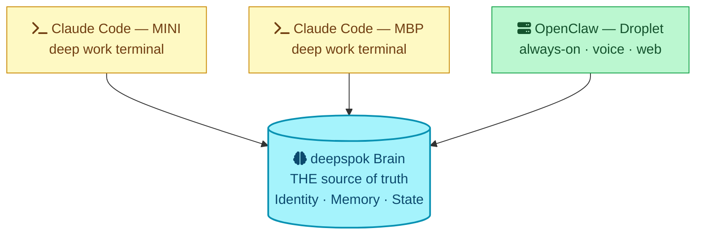
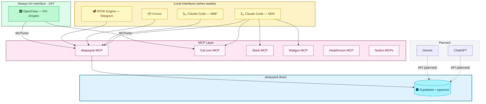
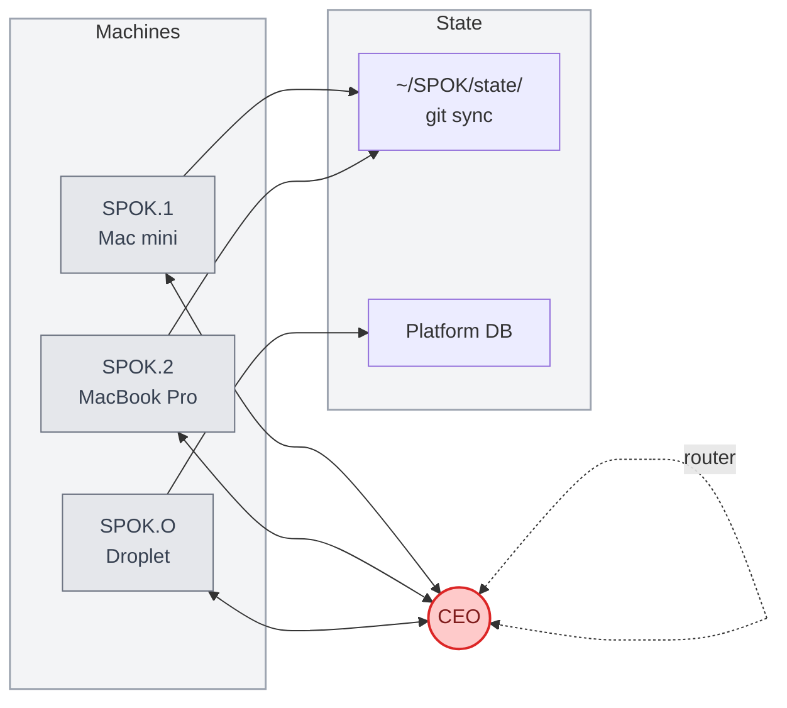
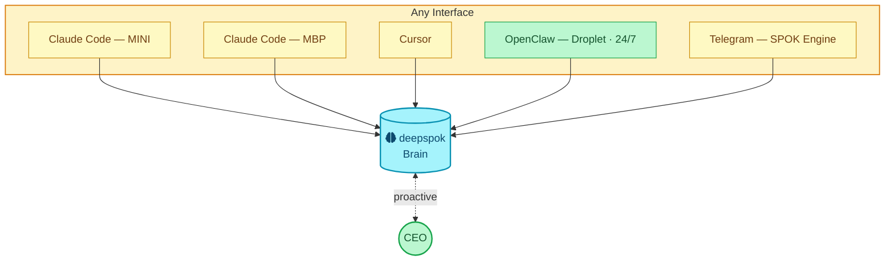
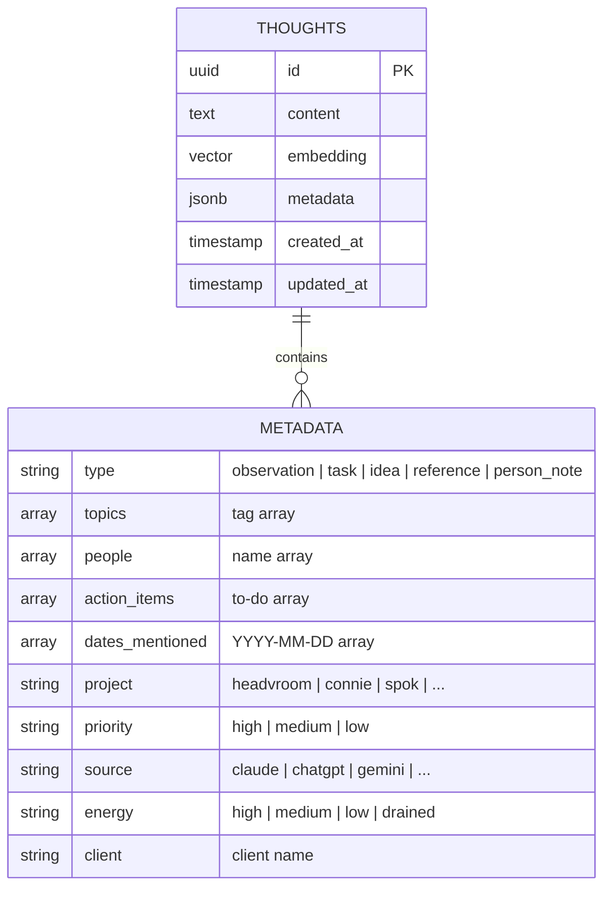
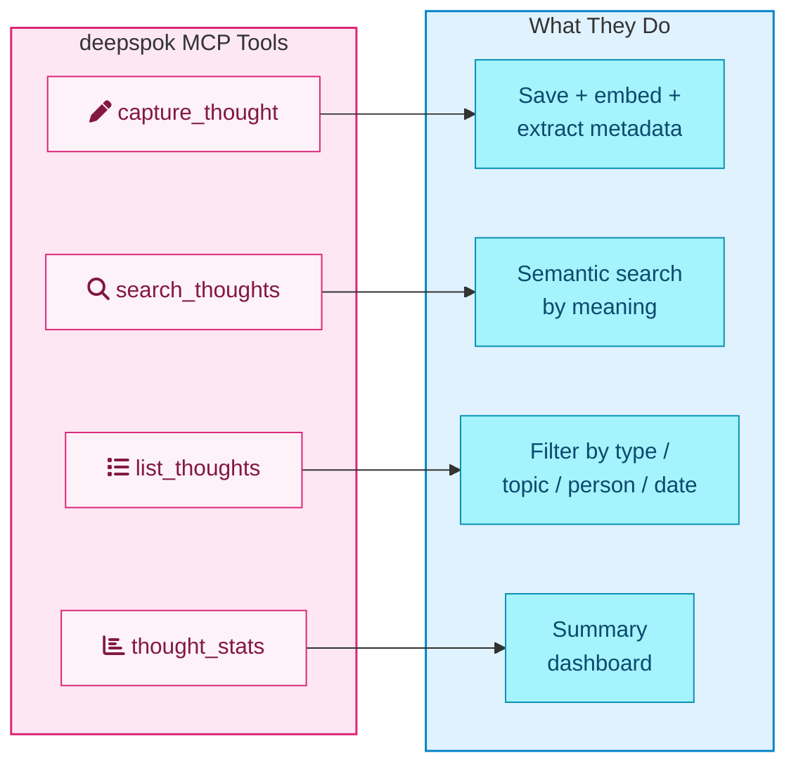
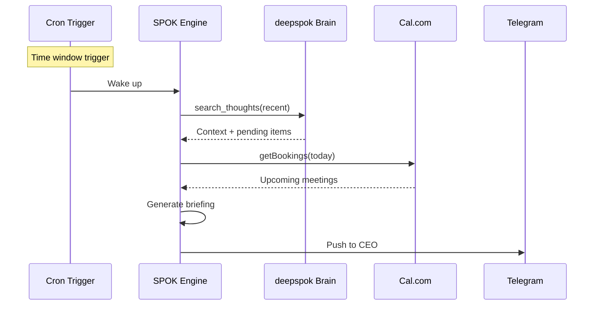
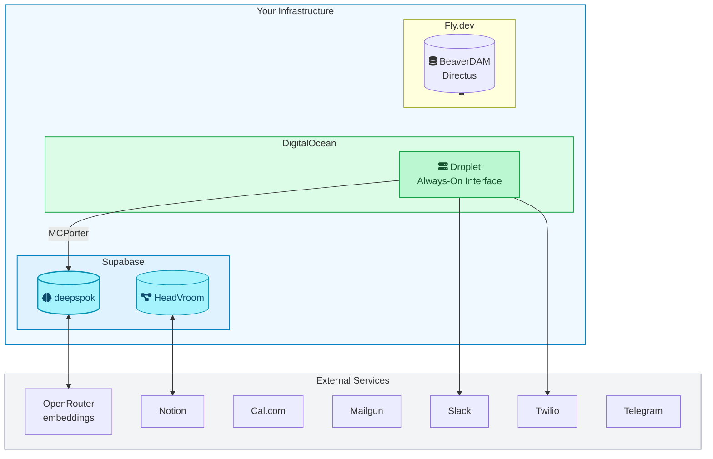
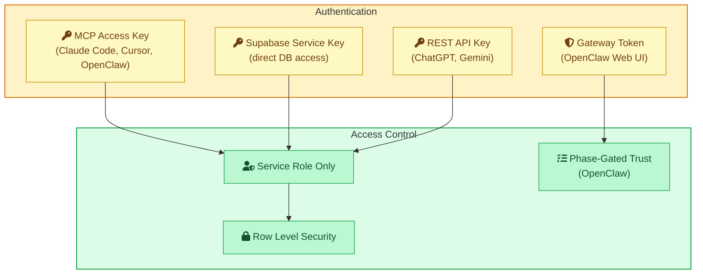

# deepspok: Architecture

**Version:** 2.0
**Last Updated:** 2026-03-23

---

## The Core Principle

> [!tip] The brain IS SPOK. The interfaces are windows. Any window can close and SPOK is still SPOK.

---

## System Overview

---

## Interface Comparison

| | Local (Claude Code) | Always-On (OpenClaw) |
|:---|:---|:---|
| **Job** | Deep work — code, files, git, architecture | Always-on — voice, comms, research, scheduling |
| **Strength** | Full filesystem access, all MCPs | Never sleeps |
| **Weakness** | Dies when Mac sleeps | Can't touch local filesystem |
| **Uptime** | When CEO is at keyboard | 24/7/365 |
| **Interface** | Terminal | Voice, Web UI, Telegram, Slack |
| **Brain** | deepspok (MCP native) | deepspok (via MCPorter) |

---

## Before & After

> [!info] Reference
> The Genesis architecture below shows [[v1-genesis/SPOK-COMMS-SOP#SPOK Registry|SPOK.1, SPOK.2, and SPOK.O]] — the machine-based versioning system replaced by deepspok. See [[v1-genesis/|Genesis docs]] for full history.

### Genesis v1.0 (Before)

> [!danger] Problem
> CEO is the router. Every pipe requires the CEO to turn the valve. More systems = more work, not less.

---

### deepspok v2.0 (After)

> [!success] Solution
> One brain. Any interface. CEO receives, not routes. The droplet is the always-on window.

---

## MCP Parity — What Each Interface Can Access

Not all interfaces have the same tools. The brain (deepspok) is universal, but other MCPs require separate wiring.

| MCP | Claude Code (MINI/MBP) | Cursor | OpenClaw (Droplet) | Purpose |
|:----|:---:|:---:|:---:|:---|
| deepspok | Done | Done | **S2** | Brain (memory) |
| Cal.com | Done | — | **S2** | Scheduling (4 silos) |
| Slack | Done | — | Phase 2 | Communication |
| Mailgun | Done | — | Phase 3 | Email |
| Notion x4 | Done | — | Phase 2 | Workspace access |
| HeadVroom | Done | — | Phase 3+ | Product database |
| BeaverDam | Done | — | Phase 3+ | Asset management |
| DigitalOcean | Done | — | Phase 3+ | Infrastructure |
| Google Workspace | Done | — | Phase 3+ | Docs/Sheets/Drive |

---

## Data Model

### Metadata Fields

| Field | Source | Values |
|:------|:-------|:-------|
| `type` | Nate | observation, task, idea, reference, person_note |
| `topics` | Nate | array of tags |
| `people` | Nate | array of names |
| `action_items` | Nate | array of to-dos |
| `dates_mentioned` | Nate | array of YYYY-MM-DD |
| `project` | SPOK | headvroom, connie, spok, doppeltalk, etc. |
| `priority` | SPOK | high, medium, low |
| `source` | SPOK | claude, chatgpt, gemini, cursor, openclaw, voice, manual |
| `energy` | SPOK | high, medium, low, drained |
| `client` | SPOK | client name if business-related |

---

## MCP Tools

---

## Proactivity

### SPOK Engine (Telegram — Active)

### Channel Map

| Channel | Direction | Purpose | Status |
|:--------|:----------|:--------|:-------|
| Telegram | SPOK → CEO | Proactive push briefings | Active (S1) |
| Slack #spoks | SPOK ↔ SPOK | Async coordination | Active (reduced role) |
| Claude Code | CEO → SPOK | Interactive deep work | Active |
| OpenClaw Web UI | CEO ↔ SPOK | Always-on access | Active (brain in S2) |
| Voice (Twilio) | CEO ↔ SPOK | Voice conversations | Planned (S3) |

---

## SPOK.O Security — Phase-Gated Trust

The always-on interface gains capabilities incrementally with security audits between phases.

| Phase | Capabilities | Security Gate | Sprint |
|:------|:------------|:--------------|:-------|
| 1 | deepspok brain + Cal.com | Token isolation, no credential leakage | S2 |
| 2 | Read-only Slack + Notion | No unintended data exposure | S2.5/S3 |
| 3 | Write access (Slack, Mailgun, etc.) | Action logging, rate limits | S3+ |
| 4 | Voice (Twilio, streaming TTS) | Webhook signing, call security | S3+ |

---

## Infrastructure Map

---

## Connection Methods

| Interface | Method | Auth | Status |
|:----------|:-------|:-----|:-------|
| Claude Code (MINI/MBP) | MCP (native) | MCP access key | Active |
| Cursor | MCP (native) | MCP access key | Active |
| OpenClaw (Droplet) | MCP (MCPorter) | MCP access key | S2 |
| SPOK Engine (Telegram) | MCP (native) | MCP access key + bot token | Active |
| ChatGPT | Custom GPT + REST | Supabase API key | Planned (S4) |
| Gemini | GEM + REST | Supabase API key | Planned (S4) |
| Voice | Twilio + OpenClaw | Twilio creds + TTS API | Planned (S3) |

---

## Security Model

> [!warning] Principle
> Service role only. No public access. All requests authenticated. OpenClaw capabilities phase-gated with audit between each.

---

*Architecture diagrams maintained by SPOK*
