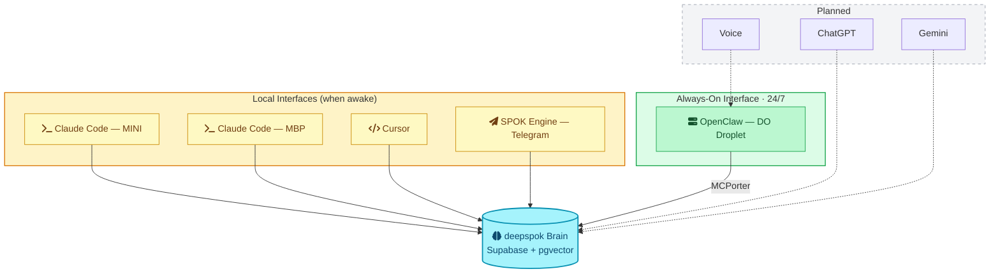

# SPOK v2.0 (deepspok)

**One brain. Any interface. Proactive by default.**

---

## Overview

SPOK v2.0 (deepspok) replaces the fragmented multi-instance Genesis architecture with a unified memory layer accessible from any AI platform. One SPOK identity, one brain, multiple interfaces.

**Key changes from [[v1-genesis/|Genesis (v1.0)]]:**
- Single brain (Supabase + pgvector) replaces git-synced state files
- One SPOK identity replaces machine-based versioning ([[v1-genesis/SPOK-COMMS-SOP#SPOK Registry|SPOK.1/SPOK.2/SPOK.O]])
- Cross-platform memory (Claude Code, Cursor, OpenClaw, ChatGPT, Gemini)
- Proactive execution via SPOK Engine (Telegram) and always-on droplet
- The droplet (formerly SPOK.O) survives as the only interface that never sleeps

---

## Core Documents

<div class="card-grid">
<a class="card" href="./manifesto">
  <span class="card-icon">📜</span>
  <span class="card-label">Manifesto</span>
  <span class="card-desc">Why we made this change (amended 2026-03-23)</span>
</a>
<a class="card" href="./architecture">
  <span class="card-icon">🏗️</span>
  <span class="card-label">Architecture</span>
  <span class="card-desc">System diagrams & data model</span>
</a>
<a class="card" href="./decisions">
  <span class="card-icon">⚖️</span>
  <span class="card-label">Decisions</span>
  <span class="card-desc">Key architectural choices</span>
</a>
<a class="card" href="./dev-logs/">
  <span class="card-icon">📓</span>
  <span class="card-label">Dev Logs</span>
  <span class="card-desc">Sprint documentation</span>
</a>
<a class="card" href="./operations/">
  <span class="card-icon">⚙️</span>
  <span class="card-label">Operations</span>
  <span class="card-desc">Runbooks & operational protocols</span>
</a>
<a class="card" href="./operations/spok-ops-manual/">
  <span class="card-icon">🐉</span>
  <span class="card-label">Ops Manual — Operation Hippocamp</span>
  <span class="card-desc">How agents handle humans & vice-versa. Templates + field reports.</span>
</a>
</div>

---

## Architecture



> [!note] Perplexity
> Remains a standalone research tool — no integration path exists.

---

## Status

| Component | Status |
|:----------|:-------|
| Genesis v1.0 archived | Done (tag: `v1.0-genesis`) |
| deepspok brain (Supabase) | Done (S0) |
| MCP deployment | Done (S0) |
| Claude Code integration | Done (S0) |
| Cursor integration | Done (S0) |
| SPOK Engine (Telegram) | Done (S1) |
| State migration + agent defs | Done (S1.5) |
| **OpenClaw + deepspok MCP** | **Next (S2)** |
| **OpenClaw + Cal.com MCP** | **Next (S2)** |
| Voice latency fix | Planned (S3) |
| ChatGPT integration | Planned (S4) |
| Gemini integration | Planned (S4) |

---

## SPOK Engine

The proactive assistant runs via Telegram channel:

```bash
claude --dangerously-load-development-channels plugin:telegram@spok-local
```

- **Bot:** @spok_engine_bot
- **Skill:** `/spok-engine`
- **Time-aware:** Morning briefings, meeting prep, check-ins, evening summaries
- **Quiet hours:** 7 PM - 6 AM (respects silence unless meeting imminent)

---

## Genesis Reference

The previous SPOK architecture (v1.0 "Genesis") is preserved for reference:
- Git tag: `v1.0-genesis`
- Git branch: `v1.x-genesis`
- Docs: [[v1-genesis/|Genesis (v1.0)]]
